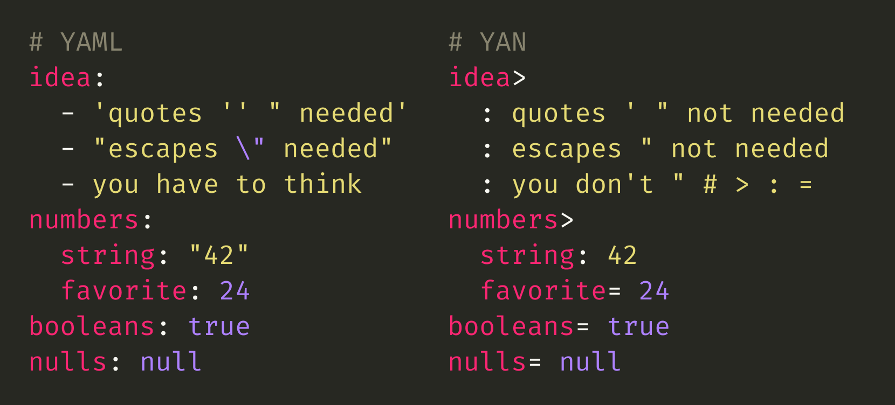

# YAN

Hristi**YAN**'s attempt at a simpler YAML.

The goal of this format is to merge the simplicity and predictability of JSON with the ergonomics of YAML.



## Overview

The official [YAML spec](https://yaml.org/spec/1.2.2/) is quite lengthy and describes an abundance of features. Despite that, the author still has to think about parsing details of the syntax when doing simple things, such as mapping values. For example, when parsed with the [`yaml` npm package](https://github.com/eemeli/yaml), the following YAML is invalid:

```yaml
test: The YAML spec is short: just 6719 lines.

# YAMLParseError: Nested mappings are not allowed in compact mappings at line 1, column 7:
# test: The YAML spec is short: just 6719 lines.
#       ^
```

To have a colon `:` character, we have to wrap the key in quotes to get it working:

```yaml
test: 'The YAML spec is short: just 6719 lines.'
```

But now, suppose we want to change `The YAML spec` to `YAML's spec`. Since YAML treats the apostrophe as the closing quote, we get another error:

```yaml
test: 'YAML's spec is short: just 6719 lines.'

# YAMLParseError: Nested mappings are not allowed in compact mappings at line 1, column 7:
# test: 'YAML's spec is short: just 6719 lines.'
#       ^
```

To fix that, we have to switch the single quotes with double quotes:

```yaml
test: "YAML's spec is short: just 6719 lines."
```

Now, suppose we want to change `short` to `"short"`. We'll have the same issue with the double quotes as we had for the single quotes:

```yaml
test: "YAML's spec is "short": just 6719 lines."

# YAMLParseError: Nested mappings are not allowed in compact mappings at line 1, column 7:
# test: "YAML's spec is "short": just 6719 lines."
#       ^
```

Finally, we have to escape the double quotes to get it working:

```yaml
test: "YAML's spec is \"short\": just 6719 lines."
```

As we can see, despite its claim to be "human-friendly", YAML has a lot of human-unfriendly pitfalls.

## Idea

Let's explore a version of YAML that can deliver a human-friendlier writing experience while maintaining JSON interoperability and avoiding pitfalls.

### Strings

The main concept is that we should be able to write keys that can have **any character** in their value string. For example:

```yan
test: The following is valid: # ' " : {} []!
```

```json
{ "test": "The following is valid: # ' \" : {} []!" }
```

This is useful when describing configuration files for AWS or [GitHub Actions](https://docs.github.com/en/actions/using-workflows/workflow-syntax-for-github-actions), for example. In such files, you often have to write bash commands which contain all sorts of characters. Not having to care about any of them is a nice feature.

### Numbers, Booleans, and `null`

In YAML, you write `42` for a number and `"42"` for a string. You write `true` for a boolean and `"true"` for a string. Here, we could just have different key/value delimiters, based on the type. Colon `:` for strings and equals sign `=` for non-strings:

```yan
str: 42
num= 42
str2: true
bool= true
str3: null
null= null
```

```json
{
    "str": "42",
    "num": 42,
    "str2": "true",
    "bool": true,
    "str3": "null",
    "null": null
}
```

### Objects

Objects are just another value type, so we can add the third and final delimiter, the greater-than `>` sign:

```yan
test: Hello
object>
    value: World
```

```json
{
    "test": "Hello",
    "object": {
        "value": "World"
    }
}
```

### Arrays

Objects lead us to arrays, which could behave just like objects, except they will have an empty key name and begin directly with the value type identifier:

```yan
array>
    : string
    = 42
    >   object= true
        nested= true
```

```json
{
    "array": [
        "string",
        42,
        {
            "object": true,
            "nested": true
        }
    ]
}
```

### Multi-Line Strings

The only character that can't be put in a single-line string is the newline character. That's because it's used to terminate the value and continue with the rest of the data. We could escape it with a backslash `\n`, but then we'll have to be able to escape the backslash itself with `\\`. The introduction of these edge cases would force us to think about parsing details again and we miss the point.

If there's a newline in our string, we probably have a different use case altogether. For this reason, we should have a separate syntax for multi-line strings:

```yan
text:
    First line is this,
    second line is this.
```

```json
{ "text": "First line is this,\nsecond line is this." }
```

#### Escaped Newlines

One important feature of YAML is the folded string, which spans multiple lines in the source file, but is parsed as a single one:

```yaml
text: >
    This is on
    a single line.
```

```json
{ "text": "This is on a single line." }
```

We could have the same here by using backslash `\` at the end of the line to denote that the newline character should be ignored:

```yan
text:
    This is on \
    a single line.
```

This is more flexible than YAML's approach because it allows us to have a combination of folded and multi-line strings:

```yan
text:
    This is on \
    a single line,
    but this isn't.
```

```json
{ "text": "This is on a single line,\nbut this isn't." }
```

We could also control whether there's a space between the joined lines. We simply add it or omit it before the backslash:

```yan
text:
    Longest word I know: \
    Super\
    cali\
    fragilistic\
    expiali\
    docious.
```

```json
{ "text": "Longest word I know: Supercalifragilisticexpialidocious." }
```

### Comments

Like YAML, comments start with a number sign `#`. Unlike YAML, comments can only be preceded by whitespace and can't be added at the end of a non-empty line. Otherwise, we would need the ability to escape `#` with `\#`, then the ability to escape `\` with `\\`, and it's all confusing again.

For example:

```yan
# This is a comment
text: This # is NOT a comment
multiline:
    The following
    # is NOT a comment
```

```json
{
    "text": "This # is NOT a comment",
    "multiline": "The following\n# is NOT a comment"
}
```

You can have comments in multi-line strings, but they'll just have to be indented less:

```yan
nested>
    text:
        The quick brown fox \
    # this is a comment
        jumps over the lazy dog.
```

```json
{
    "nested": {
        "text": "The quick brown fox jumps over the lazy dog."
    }
}
```

### Edge Cases

#### Type Delimiters in Keys

The end of a key name is denoted by the value type delimiter, followed by space. So if you have that sequence in your key name, you should escape at least one of the two characters. Let's say we want this:

```json
{ "my: key": "value" }
```

If we do this:

```yan
my: key: value
```

We'll get:

```json
{ "my": "key: value" }
```

So, the solution is to escape either the colon or the space:

```yan
# This:
my\: key: value

# Or this:
my:\ key: value
```

Note that we _can_ have an unescaped colon or space, just not in that order:

```yan
my:key: value
my key: value
my :key: value
```

```json
{
    "my:key": "value",
    "my key": "value",
    "my :key": "value"
}
```

Same applies for the `=` and `>` delimiters.

#### Number Signs in Keys

To avoid being confused with a comment, a key starting with a number sign must be escaped:

```yan
# this is a comment
\# this is: a key
```

```json
{ "# this is": "a key" }
```

As previously stated, comments can only be preceded by whitespace, so if a number sign appears anywhere after the start of a key, it doesn't have to be escaped:

```yan
this#is: valid
thisis#: valid
```

```json
{
    "this#is": "valid",
    "thisis#": "valid"
}
```

#### Whitespace in Keys

Like other key name edge cases, whitespace is escaped too:

```yan
\n\t: value
```

```json
{ "\n\t": "value" }
```

#### Preceding Spaces in Keys

If a key begins with a space, that space should be escaped:

```yan
# Leading space not escaped, so it's ignored
 key: value

# Leading space escaped
\ key: value

# Leading space escaped, second one can be left unescaped
\  key: value
```

```json
{
    "key": "value",
    " key": "value",
    "  key": "value"
}
```

#### Empty String as Key

Because quotes are not part of the syntax and we can't just denote an empty key as `""`, we'll introduce the escape sequence `\e`, meaning "empty":

```yan
\e: empty
```

```json
{ "": "empty" }
```

#### Empty Objects and Arrays

Because [YAML is a superset of JSON](http://yaml.org/spec/1.2-old/spec.html#id2759572), it allows the use of `{}` or `[]` to denote empty objects and arrays:

```yaml
object: {}
array: []
```

```json
{
    "object": {},
    "array": []
}
```

This new format, however, is not a superset of JSON and we don't have that. So we'll introduce that an empty data structure must be explicitly defined as an object or array with either `}` or `]` after the type delimiter:

```yan
object>}
array>]
```

If a data structure is not defined like that and has no nested values, it should throw an error:

```yan
unknown>
```

```
Error: Empty property "unknown" not explicitly defined as object or array.
```

#### Backslash in Multi-Line Strings

A backslash can appear almost anywhere in a multi-line string without having to be escaped. The only exception is when it appears at the end of a line, where it negates the following newline character.

```yan
text:
    back \ slash \
    new line
```

```json
{ "text": "back \\ slash new line" }
```

The reason for that is, again, to allow authors to care less about parsing. After all, if a backslash appears at the end of a line, it's most likely intentional. If it appears in the middle of a line, it probably isn't and is just part of the content.

Note that a double backslash at the end of a line essentially results in a single backslash and no newline:

```yan
text:
    backslash\\
    no newline
```

```json
{ "text": "backslash\\no newline" }
```

## Comparison with Other Formats

### YAML

While YAML has a lot more features. The majority of them can hardly be seen in actual real-life usage. This unnecessary complexity has to be reckoned with by parser and interpreter implementations of YAML, potentially leading to worse performance.

At the same time, YAML fails to provide predictability and burdens authors with its parsing details.

This format gets rid of most features that YAML supports in exchange for ease of use. Yes, there are still some edge cases that authors have to take into account, but they're mostly related to key names. And in most cases, keys follow relatively simple formats and patterns, unlike values, which can be just about anything.

### JSON

Basically, the same benefits as YAML over JSON. This format supports comments and leverages its use of whitespace to provide a more readable and less verbose way of describing data.

### TOML

As stated in [the TOML repo](https://github.com/toml-lang/toml#comparison-with-other-formats) (emphasis added):

> Because TOML is explicitly intended as a configuration file format, parsing it is easy, but it is not intended for serializing arbitrary data structures. [...] it **cannot directly serialize some data**.

Well, this format _is_ intended for serializing arbitrary data structures. It should be interoperable with JSON (and YAML, by that extent).

## Contribute

Share your thoughts:

- [Open an issue](https://github.com/hdodov/yan-format/issues)
- [Send a pull request](https://github.com/hdodov/yan-format/pulls)
- [Comment on the README](https://github.com/hdodov/yan-format/blob/master/README.md?plain=1)

If you really like the idea and you love to build parsers… 🚀
